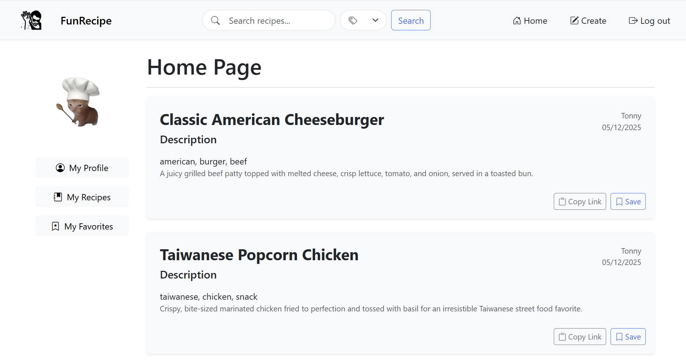

# FunRecipe - recipe app
A recipe-sharing web application built with the Python Flask framework for backend logic, SQLAlchemy for database management, and HTML/ CSS for the frontend interface.


## Table of contents
* [Contributors](#Contributors)
* [Ethical Implications](#Ethical-Implications)
* [Implemented Functional Requirements](#Implemented-Functional-Requirements)
* [Setup](#🛠️Setup)
  * [Prerequisites](#Prerequisites)
  * [Installation Instructions](#Installation-Instructions)
* [Technologies](#Technologies)
* [Dependencies](#Dependencies)

## Ethical Implications
When building our food recipe web application, we have a professional responsibility to ensure that the platform is secure, accessible, and promotes a positive user experience. Protecting user data, particularly account information and personal preferences, is critical to maintaining user trust. We must follow ethical coding practices by preventing vulnerabilities such as SQL injection or insecure password storage through the proper use of libraries like Flask-Login and SQLAlchemy.

From a global perspective, our application could reach users from diverse cultural backgrounds. Therefore, designing the app to be inclusive and user-friendly is important to avoid alienating certain groups. Economically, the platform could help users find affordable, home-cooked meal ideas, potentially reducing food waste and grocery costs for families around the world.

Environmentally, promoting home-cooked meals may also indirectly contribute to sustainability efforts by encouraging users to buy local produce and reduce packaging waste associated with processed foods. On a societal level, the application fosters a sense of community by allowing users to share recipes, comment, and connect over food, which is an important aspect of cultural and social identity.

Overall, our engineering decisions must balance functionality, security, inclusivity, and broader impacts to deliver a product that is both ethical and beneficial for users worldwide.

## Contributors
- Tonny Lee(@Tonnylee90)
- Sergio Quispe (@serggioqv)
- William Nguyen (@Seaphant)

## Implemented Functional Requirements
<format: 1. User Registration – Implemented by Tonny Lee>


## 🛠️Setup <Installation Instructions>
### Prerequisites (Make sure the following are installed:)
- python 3  
```bash
python --version ## To check if Python is install, run this command in the terminal.
```
- Git
```bash
git --version
```
- Virtual Environment
```bash
pip install virtualenv
```
### Installation Instructions
1. Clone this repository
```bash
git clone https://github.com/CMPE-131-Project
```
2. Go into the project directory and create a virtual environment  
```bash
cd pathToProject
python -m venv venv

# On Linux
source venv/bin/activate

# On window
venv\Scripts\activate
```

3. Install all dependencies
```bash
pip install -r requirements.txt
```
4. Set up the database in the terminal
Don't run this code if you want the default recipes!!!
```python
from app import db, myapp
myapp.app_context().push()
db.create_all()
```
6. Run the App
```bash
python run.py
```
## Technologies
- **Python** - Programmming language  
- **flask** - Web framwork  
- **flask-sqlalchemy** - Database Management  
- **Flask-Login** - User session management
- **HTML/ CSS** - Frontednd design 


## Dependencies <list all the Python packages that the app needs to run>
All required Python packages are listed in `requirements.txt`
